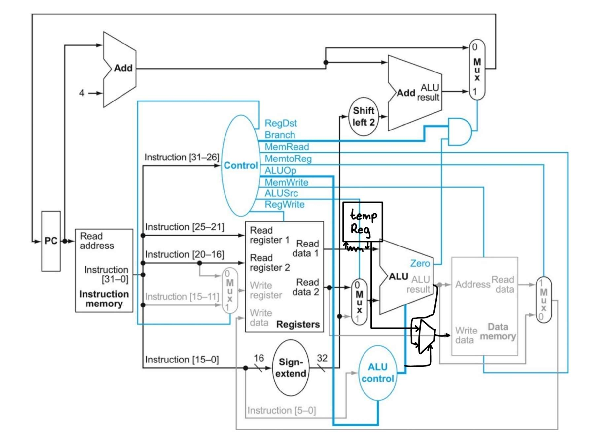

# ece-251a-spring-2025-homework-7-Amanda6623

#1 (textbook exercise 4.1)
Consider the following instruction:
Instruction: and rd, rsl, rs2
Interpretation: Reg[rd] = Reg[rs1] AND Reg[rs2]\
#1.a <§4.3> What are the values of control signals generated by the control in Figure 4.10 for this instruction?\
RegWrite = 1\
ALUSrc = 0\
ALUop = 10\
MemWrite = 0\
MemtoReg = 0\
MemRead = 0\
#1.b <§4.3> Which resources (blocks) perform a useful function for this instruction?\
The instruction memory fetches the instruction. The register file reads rsl, rs2 and writes to rd. The ALU performs the AND. The Control unit sets control signals. The MUX before ALU selects second operand from register. The MUX before register file write selects ALU result.\
#1.c <§4.3> Which resources (blocks) produce no output for this instruction? Which resources produce output that is not used?\
The sign-extend is only used for immediate-type instructions. The data memory doesn't store or load instruction.

#2 (textbook exercise 4.5)
In this exercise, we examine in detail how an instruction is executed in a single-cycle datapath. Problems in this exercise refer to a clock cycle in which the processor fetches the following instruction word: 0x00c6ba23.\
#2.a <§4.4> What are the values of the ALU control unit’s inputs for this instruction?\
100011 is input into the ALU control unit and it outputs subu\
#2.b <§4.4> What is the new PC address after this instruction is executed? Highlight the path through which this value is determined.\
Current PC -> Adder -> PC + 4 -> PC Register\
#2.d <§4.4> For each mux, show the values of its inputs and outputs during the execution of this instruction. List values that are register outputs at Reg [xn].\
ALUSrc: input = Reg[$a2] (rt) ALUSrc = 0, output = Reg[$a2]\
MemtoReg: input = ALU result, Mem data MemtoReg = 0, output = ALU result\
RegDst: input = rt ($a2), rd ($s7), RegDst = 1, output = $s7\
#2.e  <§4.4> What are the input values for the ALU and the two add units?\
ALU: Input1: Reg[$a2], Input2: Reg[$a2], Output: Reg[$a2] - Reg[$a2]\
Adder 1: Input: PC, Output: PC + 4\
Adder 2:Not used\
#2.f  <§4.4> What are the values of all inputs for the registers unit?\
Read Register 1: $a2\
Read Register 2: $a2\
Write Register: $s7\
Write Data: ALU result ($a2 - $a2)\
RegWrite: 1

#3 (textbook exercise 4.12)
Examine the difficulty of adding a proposed swap rs, rt instruction to MIPS.
Interpretation: Reg[rt] = Reg[rs]; Reg[rs] = Reg[rt]\
#3.a <§4.4> Which new functional blocks (if any) do we need for this instruction?\
We need a temporary register to store Reg[rs] while we overwrite it with Reg[rt].\
#3.b <§4.4> Which existing functional blocks (if any) require modification?\
The register file would need to write to 2 registers instead of 1 in the same cycle
#3.c <§4.4> What new data paths do we need (if any) to support this instruction?\
We need a path from Reg[rs] output to the write port for rt, a path from Reg[rt] output to the write port for rs, and a temp path or storage to hold Reg[rs] before it's overwritten.\
#3.d <§4.4> What new signals do we need (if any) from the control unit to support this instruction?\
We need a control signal that enables swap behavior and another write enable.\
#3.e <§4.4> Modify Figure 4.21 in Chapter 4 to demonstrate an implementation of this new instruction.\
